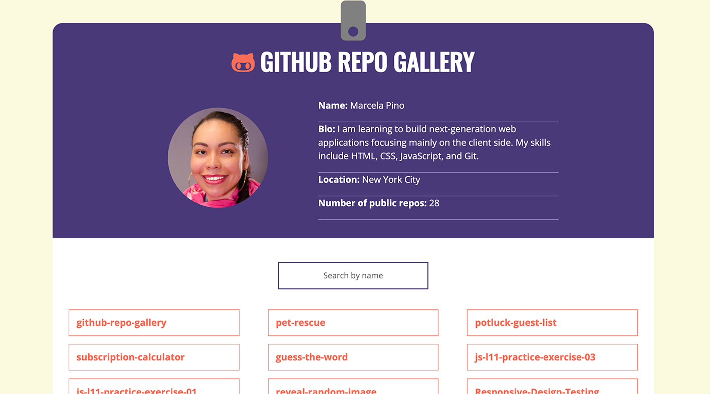

#GitHub Repo Gallery
###Description:
 #####This Front End project pulls data from my GitHub portfolio to create a gallery of repos. Visitors to the site can click on the repos to see more details.

 #####The GitHub Repo Gallery uses the GitHub API to pull data from my account to populate the name, bio, location, and the number of public repos.

 #####Users will be able to use dynamic search functionality to search the repo names. Once they’ve found a repo, they can click on it to see more information and to get a link to the repo on GitHub. Built using HTML5, CSS3, JavaScript. Mobile first approach. Responsive at two break points, 700px & 1200px.

####Visual Of GitHub Repo Gallery:

#####Acknowledgment - Authors: HTML and CSS boiler plate and starter files provided by Skill Crush
